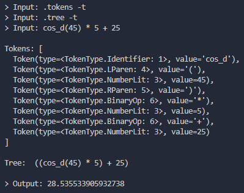
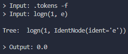

# Bobfob's Math Interpreter

## Purpose

This project was created just for fun and in order to complete the assignment in college.

## Usage

To use this interpreter, you first need to copy this repository to folder that you opened in terminal. To do this, go to **powershell** or **bash** (or any other terminal) and enter the command:

``` bash
git clone "https://github.com/Bobfob/Bobfob-s-math-interpreter.git"
```

Next, after you have copied the repository, you need to run the file "main.py" using **Python 3.11** or higher and try to type some expressions into terminal.

> To enable debug you can type commands **.tokens** and **.tree** with flags **-f** or **-t** (that stands for False and True respectively)

## Examples

>Example №1:\

\
\
Example №2:\


## Supported functions

1. **cos** - Calculates cosine with given radians
2. **sin** - Calculates sine with given radians
3. **tan** - Calculates tangent with given radians
4. **cot** - Calculates cotangent with given radians
5. **sec** - Calculates secant with given radians
6. **csc** - Calculates cosecant with given radians
7. **ln** - Calculates natural logarithm with given x
8. **log** - Calculates logarithm of base 10 with given x
9. **logn** - Calculates logarithm of base n with given x
10. **exp** - Calculates exponent with given x
11. **sqrt** - Calculates square root of given x
12. **cbrt** - Calculates cube root of given x
13. **abs** - Returns absolute value of given x
14. **floor** - Returns floored value of given x
15. **ceil** - Returns ceiled value of given x
16. **cosh** - Returns hyperbolic cosine with given x
17. **sinh** - Returns hyperbolic sine with given x
18. **tanh** - Returns hyperbolic tangent with given x
19. **coth** - Returns hyperbolic cotangent with given x
20. **sech** - Returns hyperbolic secant with given x
21. **csch** - Returns hyperbolic cosecant with given x
22. **cos_d** - Calculates cosine with given degrees
23. **sin_d** - Calculates sine with given degrees
24. **tan_d** - Calculates tangent with given degrees
25. **cot_d** - Calculates cotangent with given degrees
26. **sec_d** - Calculates secant with given degrees
27. **csc_d** - Calculates cosecant with given degrees
28. **clamp** - Returns clamped value with given value, minimal value and maximum value
29. **min** - Returns minimum value of given x, y, etc
30. **max** - Returns maximum value of given x, y, etc
